# 1. Gambaran Umum Sistem

> **Nama Proyek**: HARPA BANUA (Harga Pangan Banua)  
> **Versi**: 1.0.0

---

## 1.1 Deskripsi Sistem

HARPA BANUA adalah sistem informasi berbasis web untuk memantau dan melaporkan harga bahan pangan di berbagai pasar. Sistem ini memungkinkan petugas lapangan untuk melaporkan harga secara real-time dan admin untuk mengelola data serta menghasilkan laporan.

---

## 1.2 Arsitektur Sistem

```mermaid
flowchart TB
    subgraph Client["🖥️ Client Layer"]
        WA[Web Admin<br/>React + Vite]
        MA[Mobile App<br/>Android/iOS]
    end
    
    subgraph Server["⚙️ Server Layer"]
        API[Express.js API<br/>Port 4000]
        SSE[SSE Server<br/>Real-time Updates]
    end
    
    subgraph Database["🗄️ Database Layer"]
        MONGO[(MongoDB<br/>Atlas)]
        BLOB[Vercel Blob<br/>File Storage]
    end
    
    WA <-->|HTTP/HTTPS| API
    MA <-->|HTTP/HTTPS| API
    WA <-.->|SSE| SSE
    API <--> MONGO
    API <--> BLOB
    SSE <--> MONGO
```

---

## 1.3 Tech Stack

| Layer | Teknologi |
|-------|-----------|
| **Frontend** | React 19, Vite, TypeScript, TailwindCSS |
| **Backend** | Express.js, Node.js 18+ |
| **Database** | MongoDB Atlas |
| **Storage** | Vercel Blob |
| **Auth** | Session + bcrypt |

---

## 1.4 Aktor Sistem

| Aktor | Deskripsi | Hak Akses |
|-------|-----------|-----------|
| **Admin** | Administrator sistem | Kelola data, user, export |
| **Petugas** | Petugas lapangan | Input harga, lihat riwayat |
| **Sistem** | Proses otomatis | Auto-increment, validasi |
