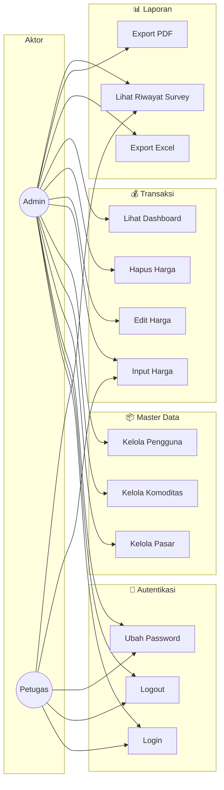

# 2. Use Case Diagram

---

## 2.1 Use Case Diagram Utama

---

## 2.2 Deskripsi Use Case

| ID | Use Case | Aktor | Deskripsi |
|----|----------|-------|-----------|
| UC1 | Login | Admin, Petugas | Masuk ke sistem dengan username & password |
| UC2 | Logout | Admin, Petugas | Keluar dari sistem |
| UC3 | Ubah Password | Admin, Petugas | Mengubah password akun sendiri |
| UC4 | Kelola Pasar | Admin | CRUD data pasar |
| UC5 | Kelola Komoditas | Admin | CRUD data komoditas |
| UC6 | Kelola Pengguna | Admin | CRUD data user, reset password |
| UC7 | Input Harga | Admin, Petugas | Memasukkan harga komoditas |
| UC8 | Edit Harga | Admin | Mengubah data harga yang sudah ada |
| UC9 | Hapus Harga | Admin | Menghapus data harga (bulk/single) |
| UC10 | Lihat Dashboard | Admin | Melihat ringkasan dan grafik |
| UC11 | Export Excel | Admin | Mengunduh laporan format Excel |
| UC12 | Export PDF | Admin | Mengunduh laporan format PDF |
| UC13 | Lihat Riwayat | Admin, Petugas | Melihat riwayat survey petugas |
