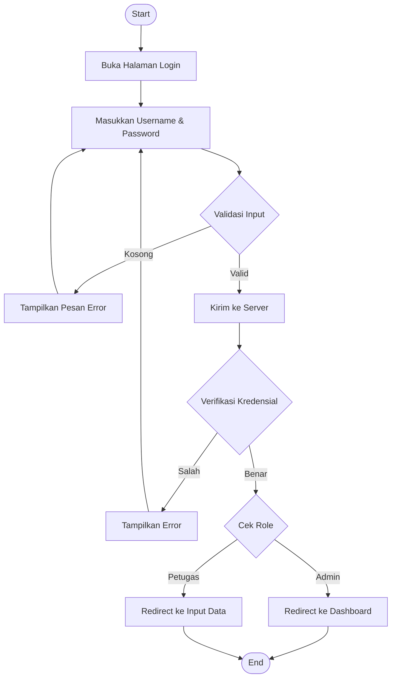
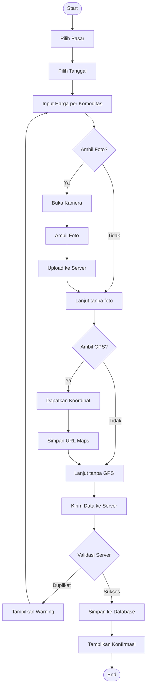
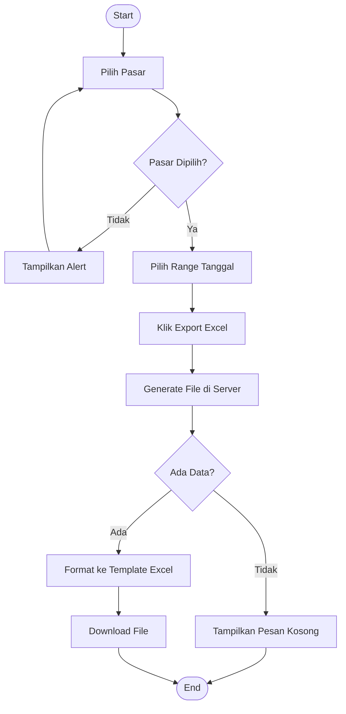

# 3. Activity Diagram

---

## 3.1 Activity Diagram: Login

```mermaid
flowchart TD
    A([Start]) --> B[Buka Halaman Login]
    B --> C[Masukkan Username & Password]
    C --> D{Validasi Input}
    D -->|Kosong| E[Tampilkan Pesan Error]
    E --> C
    D -->|Valid| F[Kirim ke Server]
    F --> G{Verifikasi Kredensial}
    G -->|Salah| H[Tampilkan Error]
    H --> C
    G -->|Benar| I{Cek Role}
    I -->|Admin| J[Redirect ke Dashboard]
    I -->|Petugas| K[Redirect ke Input Data]
    J --> L([End])
    K --> L
```

---

## 3.2 Activity Diagram: Input Harga

```mermaid
flowchart TD
    A([Start]) --> B[Pilih Pasar]
    B --> C[Pilih Tanggal]
    C --> D[Input Harga per Komoditas]
    D --> E{Ambil Foto?}
    E -->|Ya| F[Buka Kamera]
    F --> G[Ambil Foto]
    G --> H[Upload ke Server]
    E -->|Tidak| I[Lanjut tanpa foto]
    H --> I
    I --> J{Ambil GPS?}
    J -->|Ya| K[Dapatkan Koordinat]
    K --> L[Simpan URL Maps]
    J -->|Tidak| M[Lanjut tanpa GPS]
    L --> M
    M --> N[Kirim Data ke Server]
    N --> O{Validasi Server}
    O -->|Duplikat| P[Tampilkan Warning]
    P --> D
    O -->|Sukses| Q[Simpan ke Database]
    Q --> R[Tampilkan Konfirmasi]
    R --> S([End])
```

---

## 3.3 Activity Diagram: Export Excel

```mermaid
flowchart TD
    A([Start]) --> B[Pilih Pasar]
    B --> C{Pasar Dipilih?}
    C -->|Tidak| D[Tampilkan Alert]
    D --> B
    C -->|Ya| E[Pilih Range Tanggal]
    E --> F[Klik Export Excel]
    F --> G[Generate File di Server]
    G --> H{Ada Data?}
    H -->|Tidak| I[Tampilkan Pesan Kosong]
    I --> J([End])
    H -->|Ada| K[Format ke Template Excel]
    K --> L[Download File]
    L --> J
```
