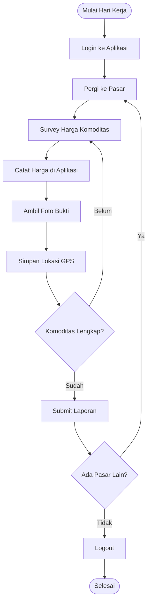
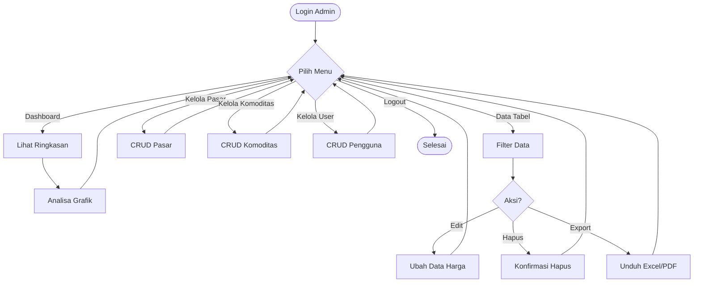

# 4. Flowchart Alur Kerja

---

## 4.1 Flowchart: Alur Kerja Petugas Lapangan

```mermaid
flowchart TD
    A([Mulai Hari Kerja]) --> B[Login ke Aplikasi]
    B --> C[Pergi ke Pasar]
    C --> D[Survey Harga Komoditas]
    D --> E[Catat Harga di Aplikasi]
    E --> F[Ambil Foto Bukti]
    F --> G[Simpan Lokasi GPS]
    G --> H{Komoditas Lengkap?}
    H -->|Belum| D
    H -->|Sudah| I[Submit Laporan]
    I --> J{Ada Pasar Lain?}
    J -->|Ya| C
    J -->|Tidak| K[Logout]
    K --> L([Selesai])
```

---

## 4.2 Flowchart: Alur Kerja Admin

```mermaid
flowchart TD
    A([Login Admin]) --> B{Pilih Menu}
    
    B -->|Dashboard| C[Lihat Ringkasan]
    C --> D[Analisa Grafik]
    D --> B
    
    B -->|Data Tabel| E[Filter Data]
    E --> F{Aksi?}
    F -->|Edit| G[Ubah Data Harga]
    G --> B
    F -->|Hapus| H[Konfirmasi Hapus]
    H --> B
    F -->|Export| I[Unduh Excel/PDF]
    I --> B
    
    B -->|Kelola Pasar| J[CRUD Pasar]
    J --> B
    
    B -->|Kelola Komoditas| K[CRUD Komoditas]
    K --> B
    
    B -->|Kelola User| L[CRUD Pengguna]
    L --> B
    
    B -->|Logout| M([Selesai])
```
