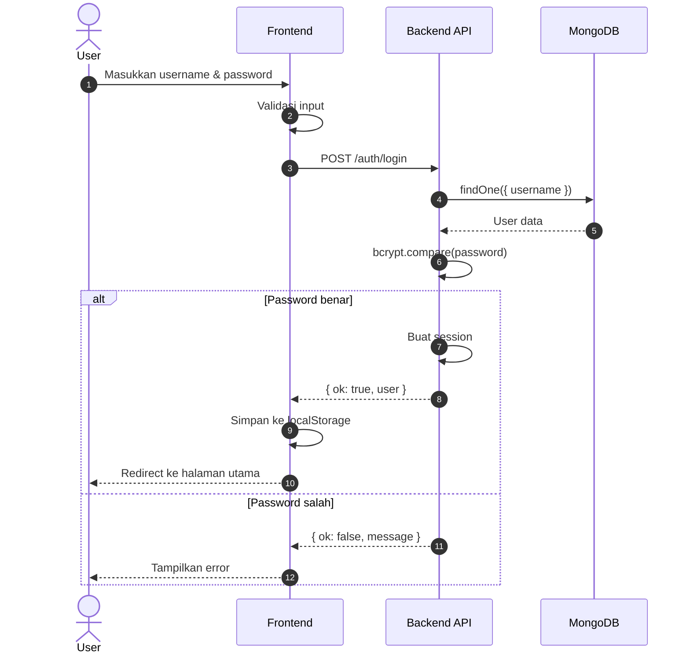
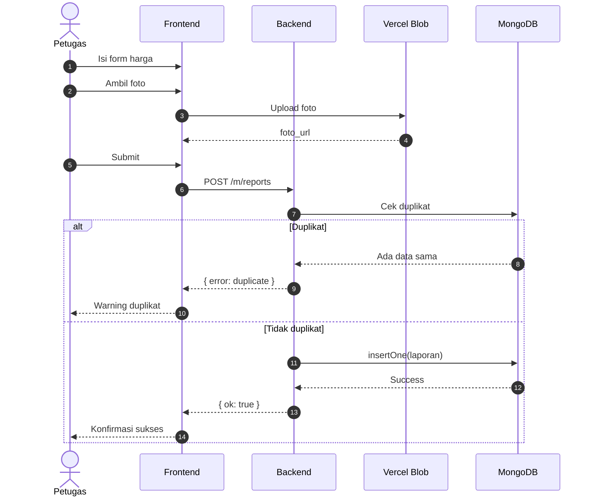
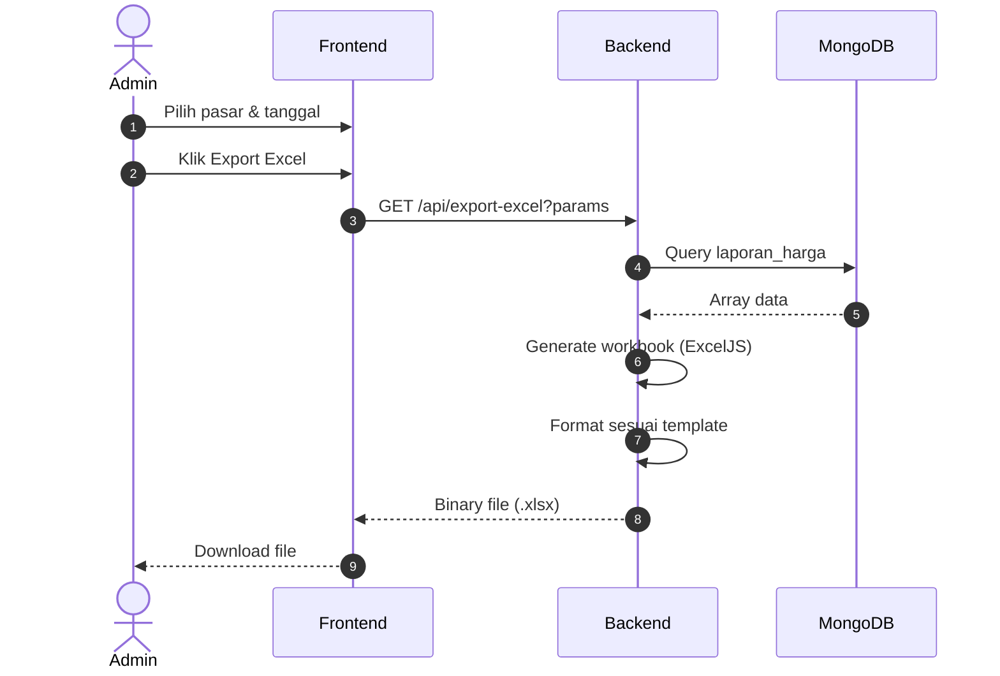
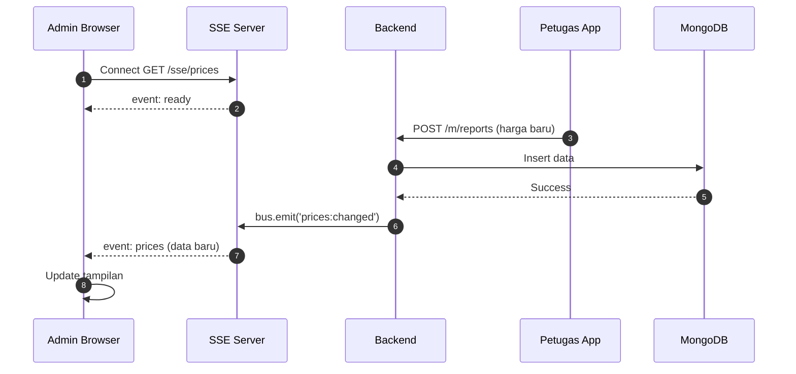

# 5. Sequence Diagram

---

## 5.1 Sequence Diagram: Login

---

## 5.2 Sequence Diagram: Input Harga

---

## 5.3 Sequence Diagram: Export Excel

---

## 5.4 Sequence Diagram: Real-time Update (SSE)

