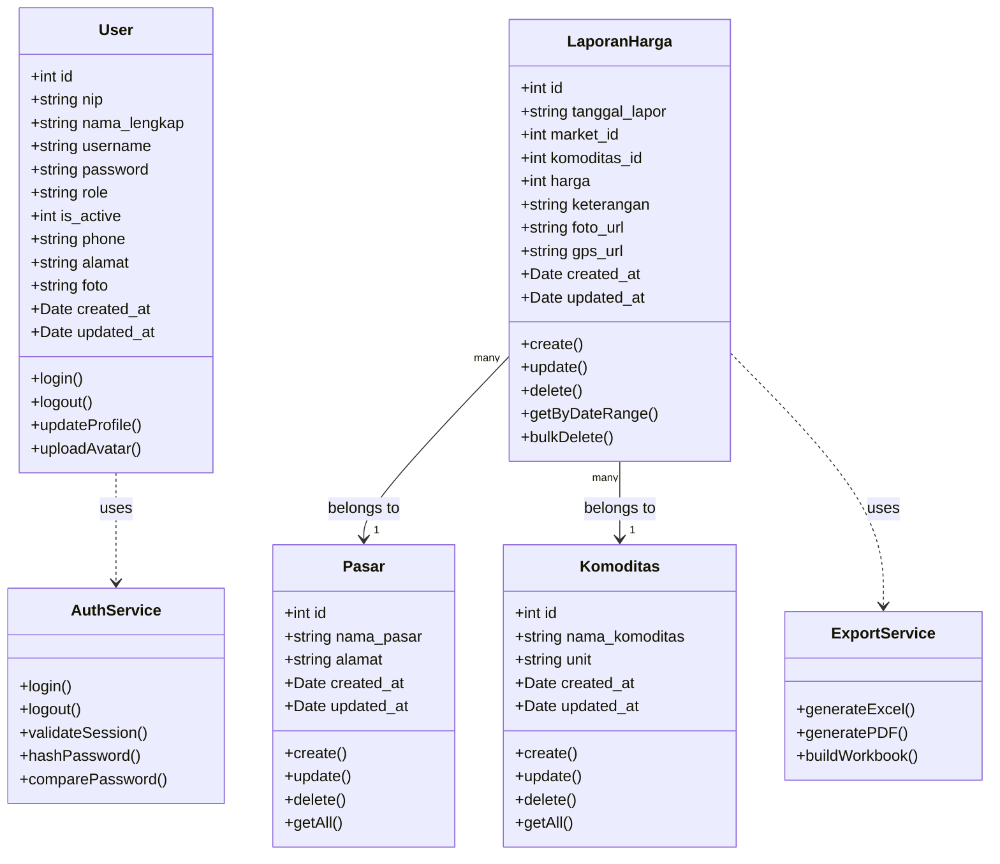
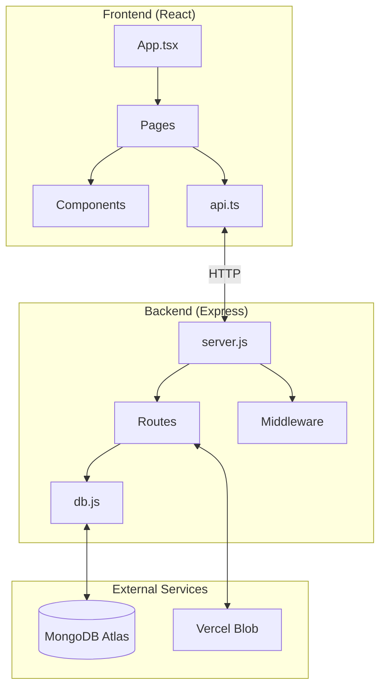

# 6. Class Diagram (UML)

---

## 6.1 Class Diagram Backend

```mermaid
classDiagram
    class User {
        +int id
        +string nip
        +string nama_lengkap
        +string username
        +string password
        +string role
        +int is_active
        +string phone
        +string alamat
        +string foto
        +Date created_at
        +Date updated_at
        +login()
        +logout()
        +updateProfile()
        +uploadAvatar()
    }
    
    class Pasar {
        +int id
        +string nama_pasar
        +string alamat
        +Date created_at
        +Date updated_at
        +create()
        +update()
        +delete()
        +getAll()
    }
    
    class Komoditas {
        +int id
        +string nama_komoditas
        +string unit
        +Date created_at
        +Date updated_at
        +create()
        +update()
        +delete()
        +getAll()
    }
    
    class LaporanHarga {
        +int id
        +string tanggal_lapor
        +int market_id
        +int komoditas_id
        +int harga
        +string keterangan
        +string foto_url
        +string gps_url
        +Date created_at
        +Date updated_at
        +create()
        +update()
        +delete()
        +getByDateRange()
        +bulkDelete()
    }
    
    class ExportService {
        +generateExcel()
        +generatePDF()
        +buildWorkbook()
    }
    
    class AuthService {
        +login()
        +logout()
        +validateSession()
        +hashPassword()
        +comparePassword()
    }
    
    LaporanHarga "many" --> "1" Pasar : belongs to
    LaporanHarga "many" --> "1" Komoditas : belongs to
    User ..> AuthService : uses
    LaporanHarga ..> ExportService : uses
```

---

## 6.2 Component Diagram

```mermaid
flowchart TB
    subgraph Frontend["Frontend (React)"]
        App[App.tsx]
        Pages[Pages]
        Components[Components]
        API_Client[api.ts]
        
        App --> Pages
        Pages --> Components
        Pages --> API_Client
    end
    
    subgraph Backend["Backend (Express)"]
        Server[server.js]
        Routes[Routes]
        Middleware[Middleware]
        DB_Tools[db.js]
        
        Server --> Routes
        Server --> Middleware
        Routes --> DB_Tools
    end
    
    subgraph External["External Services"]
        MongoDB[(MongoDB Atlas)]
        Vercel_Blob[Vercel Blob]
    end
    
    API_Client <-->|HTTP| Server
    DB_Tools <--> MongoDB
    Routes <--> Vercel_Blob
```
