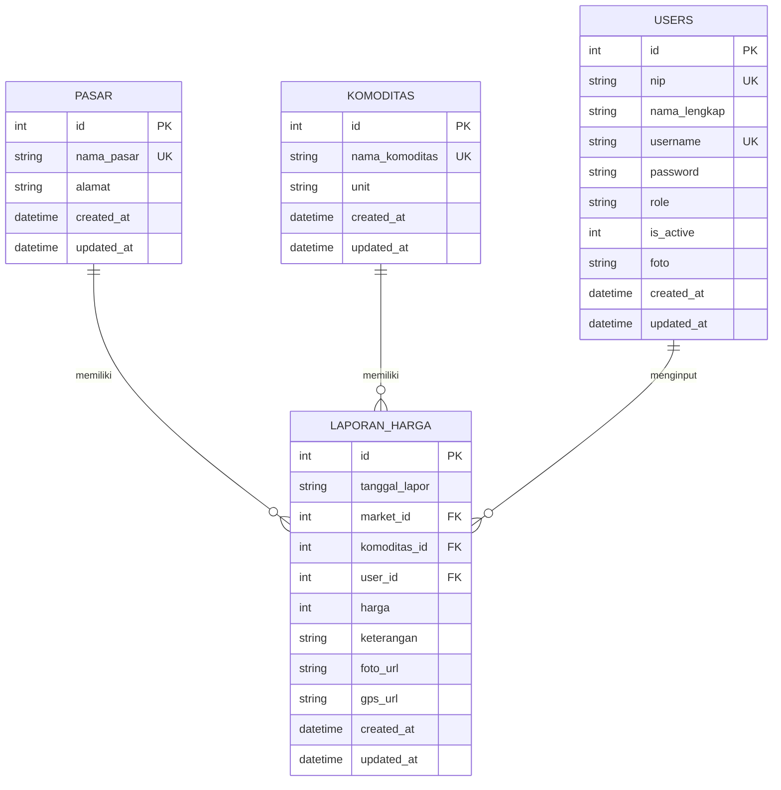
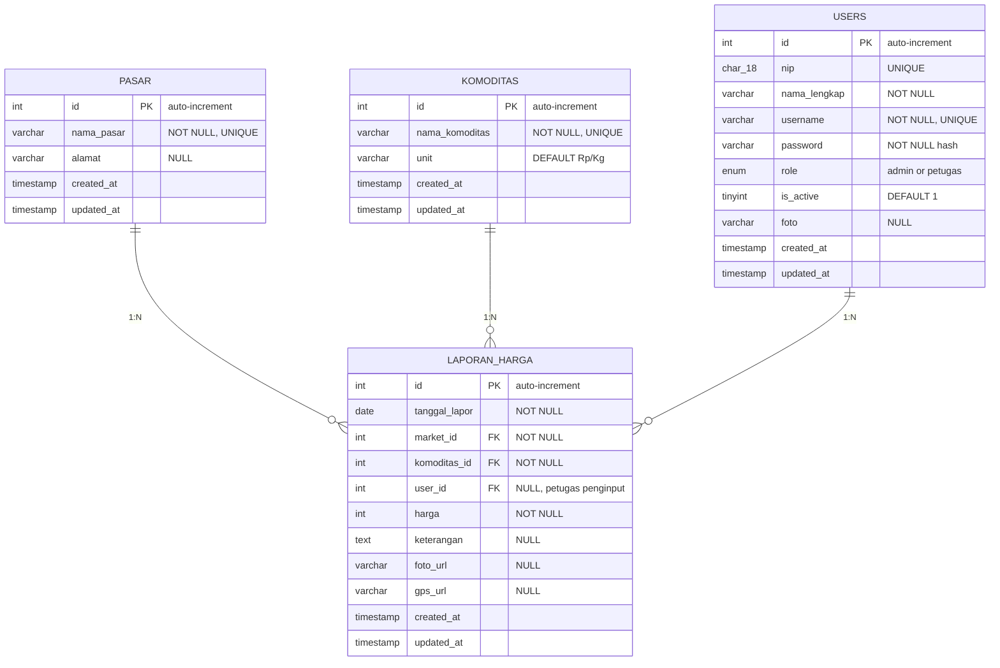

# 8. Entity Relationship Diagram (ERD)

---

## 8.1 ERD Konseptual

---

## 8.2 ERD Fisik dengan Kardinalitas

---

## 8.3 Relasi dan Constraint

| Relasi | Parent | Child | Kardinalitas | On Delete |
|--------|--------|-------|--------------|-----------|
| FK_market | `pasar` | `laporan_harga` | 1:N | RESTRICT |
| FK_komoditas | `komoditas` | `laporan_harga` | 1:N | RESTRICT |
| FK_user | `users` | `laporan_harga` | 1:N | SET NULL |

> **Catatan**: MongoDB tidak memiliki foreign key constraint bawaan. Validasi relasi dilakukan di level aplikasi.
