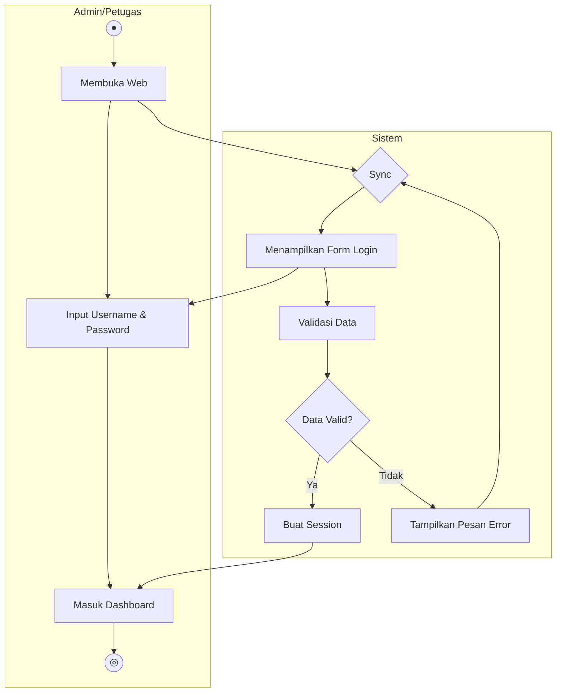
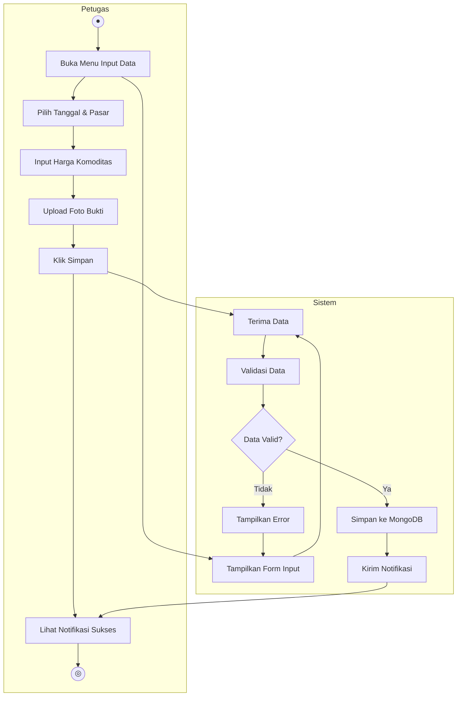
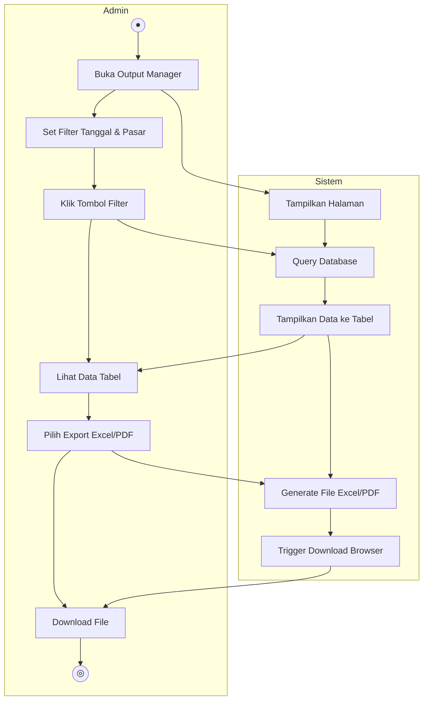
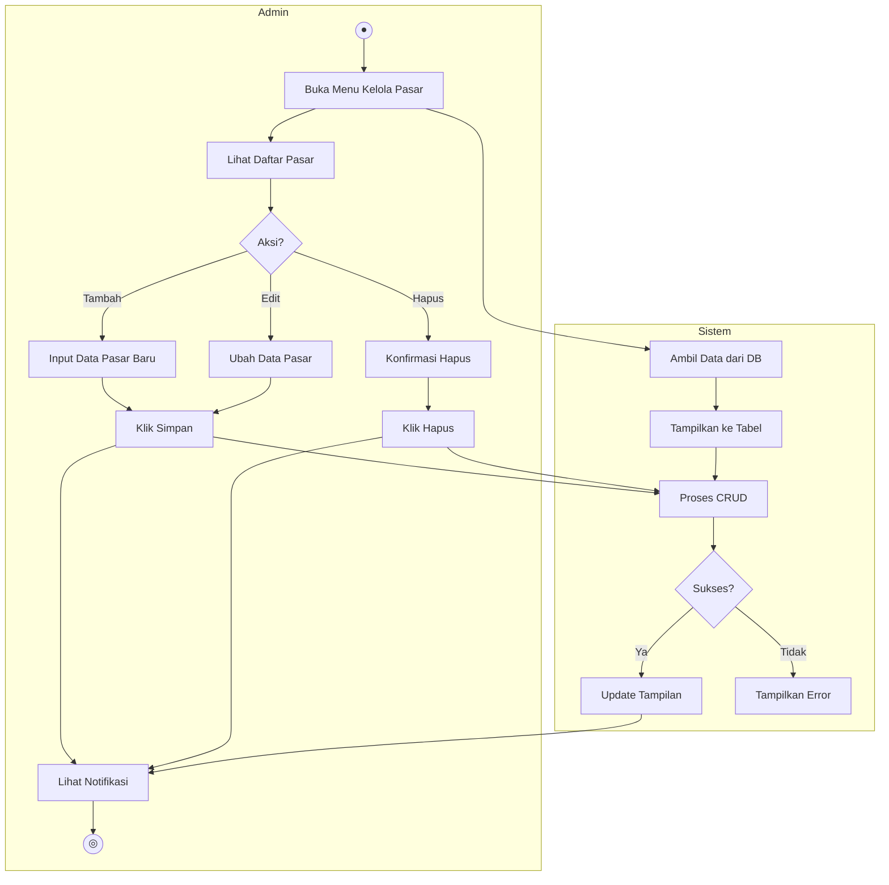
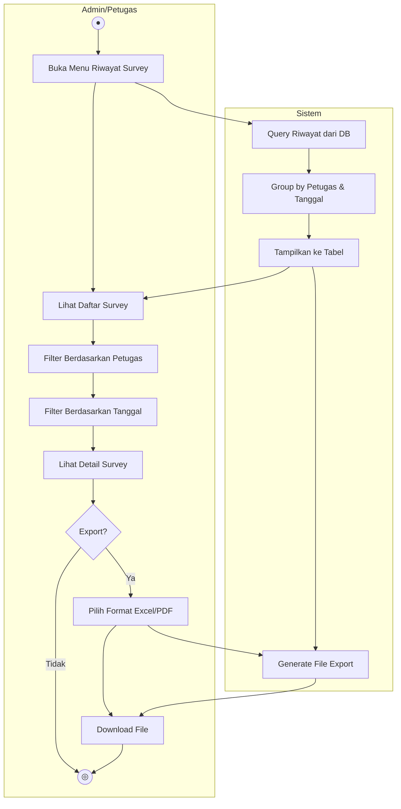

# Activity Diagram - HARPA BANUA

## 1. Activity Diagram Login

Copy ke Draw.io → Arrange → Insert → Advanced → Mermaid



---

## 2. Activity Diagram Input Harga



---

## 3. Activity Diagram Export Laporan



---

## 4. Activity Diagram Kelola Pasar



---

## 5. Activity Diagram Riwayat Survey



---

## Cara Menggunakan

### Opsi 1: Draw.io
1. Buka **app.diagrams.net**
2. Klik **Arrange → Insert → Advanced → Mermaid**
3. Copy kode di atas (tanpa ```)
4. Klik **Insert**

### Opsi 2: Mermaid Live Editor
1. Buka **mermaid.live**
2. Paste kode Mermaid
3. Download sebagai PNG/SVG

### Opsi 3: PlantUML
1. Buka **plantuml.com/plantuml**
2. Convert ke format PlantUML

---

## Keterangan Simbol

| Simbol | Nama | Keterangan |
|--------|------|------------|
| ((●)) | Start | Titik awal aktivitas |
| ((◎)) | End | Titik akhir aktivitas |
| [ ] | Action | Proses/aktivitas |
| { } | Decision | Percabangan keputusan |
| --> | Arrow | Alur proses |
