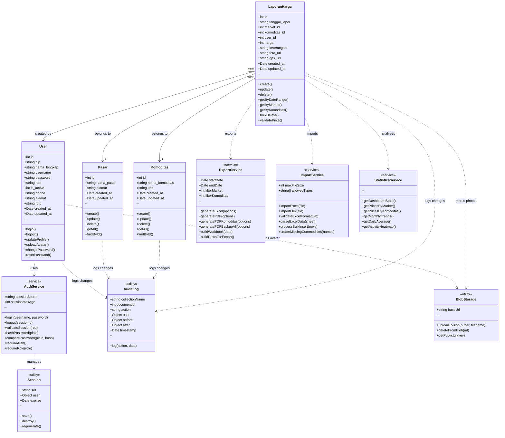

# Class Diagram Sistem Informasi HARPA BANUA

## Gambaran Umum

Class Diagram ini menggambarkan struktur kelas-kelas dalam Sistem Informasi Harga Pangan HARPA BANUA. Diagram ini dibagi menjadi tiga kategori utama:

1. **Entity Classes** - Kelas yang merepresentasikan data/entitas bisnis
2. **Service Classes** - Kelas yang menyediakan layanan/fungsionalitas
3. **Utility Classes** - Kelas pendukung/helper

---

## Diagram Mermaid

Copy kode di bawah ke [Mermaid Live Editor](https://mermaid.live/) untuk render menjadi gambar.

---

## Deskripsi Kelas

### 1. Entity Classes

#### User
Kelas yang merepresentasikan pengguna sistem (Admin atau Petugas).

| Atribut | Tipe | Keterangan |
|---------|------|------------|
| id | int | Primary key (auto-increment) |
| nip | string | NIP 18 digit (wajib unik) |
| nama_lengkap | string | Nama lengkap pengguna |
| username | string | Username untuk login (unik) |
| password | string | Password terenkripsi (bcrypt) |
| role | string | Role: admin / petugas / super_admin |
| is_active | int | Status: 1 (aktif) / 0 (nonaktif) |
| phone | string | Nomor telepon (opsional) |
| alamat | string | Alamat (opsional) |
| foto | string | URL foto profil di Vercel Blob |
| created_at | Date | Timestamp pembuatan |
| updated_at | Date | Timestamp update terakhir |

#### Pasar
Kelas yang merepresentasikan data pasar tradisional.

| Atribut | Tipe | Keterangan |
|---------|------|------------|
| id | int | Primary key (auto-increment) |
| nama_pasar | string | Nama pasar (unik) |
| alamat | string | Alamat pasar |
| created_at | Date | Timestamp pembuatan |
| updated_at | Date | Timestamp update terakhir |

#### Komoditas
Kelas yang merepresentasikan jenis komoditas pangan.

| Atribut | Tipe | Keterangan |
|---------|------|------------|
| id | int | Primary key (auto-increment) |
| nama_komoditas | string | Nama komoditas (unik) |
| unit | string | Satuan: (Rp/Kg) atau (Rp/Liter) |
| created_at | Date | Timestamp pembuatan |
| updated_at | Date | Timestamp update terakhir |

#### LaporanHarga
Kelas utama yang merepresentasikan laporan harga harian.

| Atribut | Tipe | Keterangan |
|---------|------|------------|
| id | int | Primary key (auto-increment) |
| tanggal_lapor | string | Tanggal laporan (YYYY-MM-DD) |
| market_id | int | Foreign key → Pasar |
| komoditas_id | int | Foreign key → Komoditas |
| user_id | int | Foreign key → User (pelapor) |
| harga | int | Harga dalam Rupiah |
| keterangan | string | Catatan/keterangan (opsional) |
| foto_url | string | URL foto bukti (Vercel Blob) |
| gps_url | string | URL lokasi GPS (opsional) |
| created_at | Date | Timestamp pembuatan |
| updated_at | Date | Timestamp update terakhir |

---

### 2. Service Classes

#### AuthService
Layanan autentikasi dan otorisasi pengguna.

| Method | Parameter | Return | Keterangan |
|--------|-----------|--------|------------|
| login | username, password | User | Autentikasi login |
| logout | sessionId | boolean | Hapus session |
| validateSession | req | boolean | Validasi session aktif |
| hashPassword | plain | string | Hash password dengan bcrypt |
| comparePassword | plain, hash | boolean | Verifikasi password |
| requireAuth | - | middleware | Middleware cek login |
| requireRole | role | middleware | Middleware cek role |

#### ExportService
Layanan export data ke berbagai format.

| Method | Parameter | Return | Keterangan |
|--------|-----------|--------|------------|
| generateExcel | options | Buffer | Generate file Excel |
| generatePDF | options | Buffer | Generate file PDF |
| generatePDFKomoditas | options | Buffer | PDF per komoditas |
| generatePDFBackupAll | options | Buffer | PDF backup semua |
| buildWorkbook | data | Workbook | Build Excel workbook |

#### ImportService
Layanan import data dari file Excel.

| Method | Parameter | Return | Keterangan |
|--------|-----------|--------|------------|
| importExcel | file | Result | Import standar |
| importFlex | file | Result | Import fleksibel |
| validateExcelFormat | workbook | boolean | Validasi format |
| parseExcelData | sheet | Row[] | Parse data |
| processBulkInsert | rows | Result | Bulk insert ke DB |

#### StatisticsService
Layanan statistik dan analisis data.

| Method | Parameter | Return | Keterangan |
|--------|-----------|--------|------------|
| getDashboardStats | - | Stats | Statistik dashboard |
| getPricesByMarket | marketId | Price[] | Harga per pasar |
| getMonthlyTrends | params | Trend[] | Tren bulanan |
| getDailyAverage | params | Avg[] | Rata-rata harian |

---

### 3. Utility Classes

#### Session
Manajemen session login pengguna.

| Atribut | Tipe | Keterangan |
|---------|------|------------|
| sid | string | Session ID |
| user | Object | Data user yang login |
| expires | Date | Waktu kadaluarsa |

#### AuditLog
Pencatatan log perubahan data (audit trail).

| Atribut | Tipe | Keterangan |
|---------|------|------------|
| collectionName | string | Nama collection |
| documentId | int | ID dokumen yang diubah |
| action | string | Aksi: create/update/delete |
| user | Object | User yang melakukan aksi |
| before | Object | Data sebelum perubahan |
| after | Object | Data setelah perubahan |
| timestamp | Date | Waktu aksi |

#### BlobStorage
Penyimpanan file ke Vercel Blob Storage.

| Method | Parameter | Return | Keterangan |
|--------|-----------|--------|------------|
| uploadToBlob | buffer, filename | Blob | Upload file |
| deleteFromBlob | url | boolean | Hapus file |
| getPublicUrl | key | string | Get URL public |

---

## Relasi Antar Kelas

| Dari | Ke | Kardinalitas | Tipe | Keterangan |
|------|-----|--------------|------|------------|
| LaporanHarga | Pasar | Many to 1 | Association | Laporan mengacu ke satu pasar |
| LaporanHarga | Komoditas | Many to 1 | Association | Laporan mengacu ke satu komoditas |
| LaporanHarga | User | Many to 1 | Association | Laporan dibuat oleh satu user |
| User | AuthService | - | Dependency | User menggunakan AuthService |
| User | BlobStorage | - | Dependency | Upload avatar |
| LaporanHarga | ExportService | - | Dependency | Export laporan |
| LaporanHarga | ImportService | - | Dependency | Import laporan |
| LaporanHarga | StatisticsService | - | Dependency | Analisis data |
| All Entities | AuditLog | - | Dependency | Audit trail |

---

## Notasi UML

- **+** : Public (dapat diakses dari luar kelas)
- **-** : Private (hanya dapat diakses dari dalam kelas)
- **#** : Protected (dapat diakses dari kelas turunan)
- **-->** : Association (relasi antar objek)
- **..>** : Dependency (ketergantungan)
- **<<service>>** : Stereotip untuk kelas layanan
- **<<utility>>** : Stereotip untuk kelas utilitas

---

**Gambar 3.6** Class Diagram Sistem Informasi Harga Pangan HARPA BANUA
