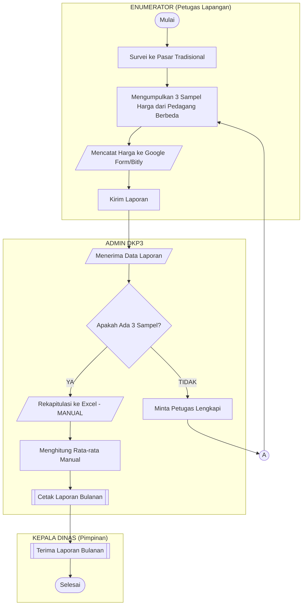
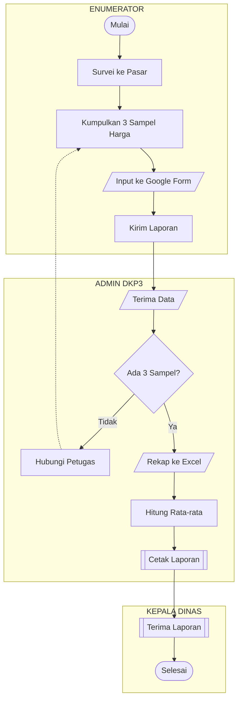

# Flowmap Sistem Berjalan - Pelaporan Harga Pangan (Manual)

## Diagram Mermaid (Copy ke Draw.io → Advanced → Mermaid)



---

## Versi Alternatif (Lebih Detail)



---

## Deskripsi Alur Sistem Berjalan

### Kolom 1: ENUMERATOR (Petugas Lapangan)
1. **Mulai** - Memulai tugas survei harian
2. **Survei ke Pasar** - Pergi ke pasar tradisional
3. **Mengumpulkan 3 Sampel Harga** - Mencatat harga dari 3 pedagang berbeda untuk setiap komoditas
4. **Mencatat ke Google Form** - Input data secara manual via form online
5. **Kirim Laporan** - Mengirim data ke Admin

### Kolom 2: ADMIN DKP3
1. **Menerima Data** - Menerima laporan dari petugas
2. **Cek Validasi: Ada 3 Sampel?**
   - **TIDAK** → Minta petugas lengkapi data
   - **YA** → Lanjut proses
3. **Rekapitulasi ke Excel** - Pindahkan data ke spreadsheet (MANUAL)
4. **Menghitung Rata-rata** - Hitung rata-rata 3 sampel secara manual
5. **Cetak Laporan Bulanan** - Generate laporan untuk pimpinan

### Kolom 3: KEPALA DINAS
1. **Terima Laporan** - Menerima laporan bulanan
2. **Selesai** - Proses selesai

---

## Cara Menggunakan di Draw.io:

1. Buka **Draw.io** (app.diagrams.net)
2. Klik menu **Arrange → Insert → Advanced → Mermaid...**
3. Copy kode di atas (tanpa tanda ```)
4. Paste dan klik **Insert**

---

## Legenda Simbol:

| Simbol | Kode | Keterangan |
|--------|------|------------|
| Oval | `([text])` | Terminal (Mulai/Selesai) |
| Kotak | `[text]` | Proses |
| Parallelogram | `[/text/]` | Input/Output Manual |
| Belah Ketupat | `{text}` | Decision (Keputusan) |
| Kotak Garis Ganda | `[[text]]` | Dokumen |
| Lingkaran | `((text))` | Konektor |
| Garis Solid | `-->` | Alur Normal |
| Garis Putus | `-.->` | Alur Balik |
