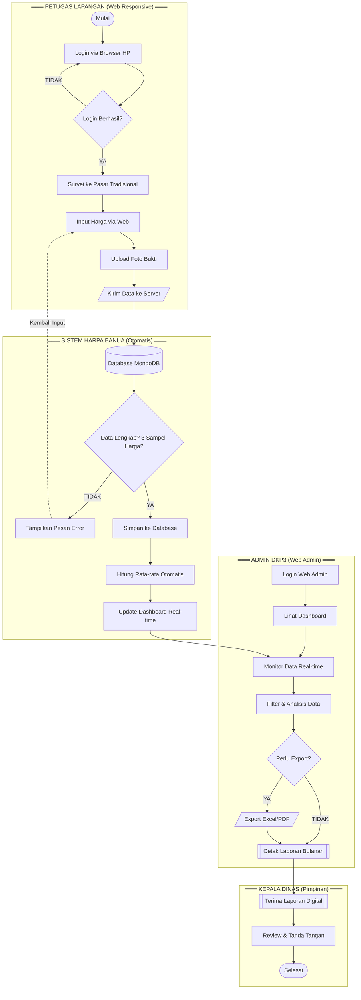
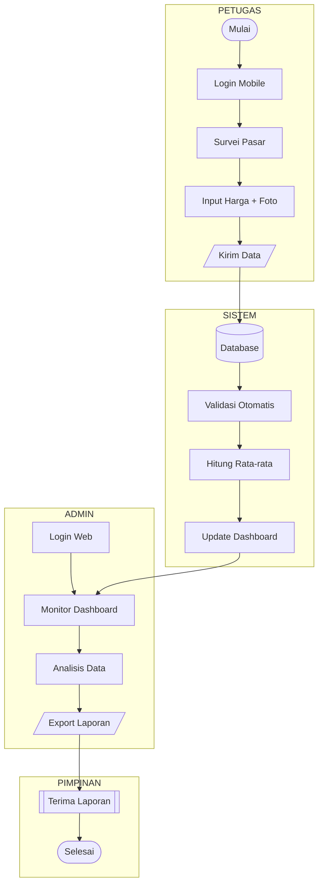

# Flowmap Sistem Usulan - Aplikasi HARPA BANUA

## Diagram Mermaid (Copy ke Draw.io → Advanced → Mermaid)



---

## Versi Swimlane Sederhana



---

## Perbandingan Sistem Berjalan vs Sistem Usulan

| Aspek | Sistem Berjalan (Manual) | Sistem Usulan (HARPA BANUA) |
|-------|--------------------------|----------------------------|
| Input Data | Google Form/Bitly | Aplikasi Mobile Khusus |
| Validasi | Manual oleh Admin | Otomatis oleh Sistem |
| Bukti Survei | Tidak Ada | Foto + GPS Otomatis |
| Rekap Data | Copy-paste ke Excel | Otomatis tersimpan di Database |
| Hitung Rata-rata | Manual dengan kalkulator | Otomatis oleh Sistem |
| Laporan | Ketik manual di Word | Generate Excel/PDF otomatis |
| Monitoring | Tidak real-time | Dashboard Real-time |
| Backup Data | File lokal (risiko hilang) | Cloud Database (aman) |

---

## Deskripsi Alur Sistem Usulan

### Kolom 1: PETUGAS LAPANGAN (Mobile App)
1. **Mulai** - Memulai tugas survei
2. **Login Aplikasi** - Masuk dengan akun yang terdaftar
3. **Survei ke Pasar** - Pergi ke pasar tradisional
4. **Input Harga via Mobile** - Input langsung di aplikasi
5. **Foto & GPS Otomatis** - Sistem mencatat bukti lokasi
6. **Kirim Data** - Data terkirim ke server secara real-time

### Kolom 2: SISTEM (Otomatis)
1. **Database MongoDB** - Data tersimpan di cloud
2. **Validasi Otomatis** - Sistem cek kelengkapan data
3. **Hitung Rata-rata** - Otomatis tanpa intervensi manual
4. **Update Dashboard** - Data langsung tampil di dashboard

### Kolom 3: ADMIN DKP3 (Web Admin)
1. **Login Web Admin** - Masuk ke panel admin
2. **Monitor Dashboard** - Lihat data real-time
3. **Filter & Analisis** - Analisis berdasarkan pasar/komoditas
4. **Export Laporan** - Generate Excel/PDF dengan 1 klik

### Kolom 4: KEPALA DINAS
1. **Terima Laporan Digital** - Laporan siap pakai
2. **Selesai** - Proses efisien

---

## Keunggulan Sistem Usulan

1. **Efisiensi Waktu** - Tidak perlu rekap manual
2. **Akurasi Data** - Validasi otomatis, minim human error  
3. **Real-time** - Data langsung tersedia
4. **Bukti Digital** - Foto & GPS sebagai validasi
5. **Backup Otomatis** - Data aman di cloud
6. **Paperless** - Mengurangi penggunaan kertas

---

## Cara Menggunakan di Draw.io:

1. Buka **Draw.io** (app.diagrams.net)
2. Klik menu **Arrange → Insert → Advanced → Mermaid...**
3. Copy kode di atas (tanpa tanda ```)
4. Paste dan klik **Insert**
