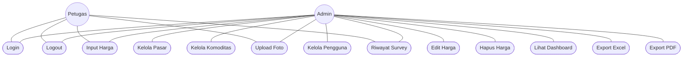

# Gambar 3.2 Use Case Diagram Sistem Usulan

## Diagram Mermaid (Copy ke Draw.io → Advanced → Mermaid)


---

## Versi Alternatif (Lebih Sederhana untuk Draw.io)



---

## Deskripsi Use Case

| ID | Use Case | Aktor | Deskripsi |
|----|----------|-------|-----------|
| UC1 | Login | Admin, Petugas | Masuk ke sistem dengan username & password |
| UC2 | Logout | Admin, Petugas | Keluar dari sistem |
| UC3 | Kelola Pasar | Admin | Tambah, ubah, hapus data pasar |
| UC4 | Kelola Komoditas | Admin | Tambah, ubah, hapus data komoditas |
| UC5 | Kelola Pengguna | Admin | Tambah, ubah, hapus, reset password user |
| UC6 | Input Harga | Admin, Petugas | Memasukkan harga komoditas |
| UC7 | Edit Harga | Admin | Mengubah data harga yang sudah ada |
| UC8 | Hapus Harga | Admin | Menghapus data harga (bulk/single) |
| UC9 | Upload Foto | Admin, Petugas | Mengunggah foto bukti survei |
| UC10 | Lihat Dashboard | Admin | Melihat ringkasan statistik dan grafik |
| UC11 | Export Excel | Admin | Mengunduh laporan format Excel |
| UC12 | Export PDF | Admin | Mengunduh laporan format PDF |
| UC13 | Riwayat Survey | Admin, Petugas | Melihat riwayat survey petugas |

---

## Hak Akses Per Aktor

| Use Case | Admin | Petugas |
|----------|:-----:|:-------:|
| Login | ✅ | ✅ |
| Logout | ✅ | ✅ |
| Kelola Pasar | ✅ | ❌ |
| Kelola Komoditas | ✅ | ❌ |
| Kelola Pengguna | ✅ | ❌ |
| Input Harga | ✅ | ✅ |
| Edit Harga | ✅ | ❌ |
| Hapus Harga | ✅ | ❌ |
| Upload Foto | ✅ | ✅ |
| Lihat Dashboard | ✅ | ❌ |
| Export Excel | ✅ | ❌ |
| Export PDF | ✅ | ❌ |
| Riwayat Survey | ✅ | ✅ |

---

## Cara Menggunakan di Draw.io

1. Buka **Draw.io** (app.diagrams.net)
2. Klik **Arrange → Insert → Advanced → Mermaid...**
3. Copy kode di atas (tanpa tanda ```)
4. Paste dan klik **Insert**

### Tips untuk Use Case di Draw.io Manual:
1. Gunakan shape **Ellipse** untuk Use Case
2. Gunakan shape **Actor** (stick figure) untuk Aktor
3. Gambar **rectangle** besar dengan judul "SISTEM HARPA BANUA"
4. Hubungkan aktor ke use case dengan **garis tanpa panah**
