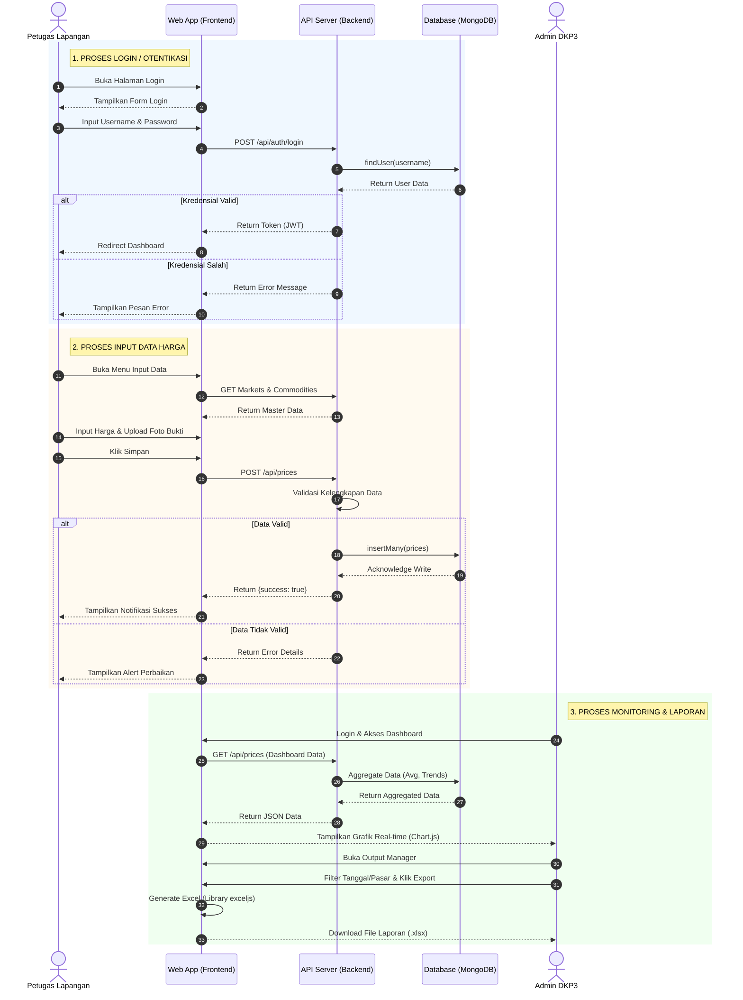

# Sequence Diagram Lengkap (Mermaid)

Copy kode di bawah ini dan paste di **[Mermaid Live Editor](https://mermaid.live/)** atau **Draw.io** (Insert > Advanced > Mermaid) untuk download sebagai PNG/SVG.

